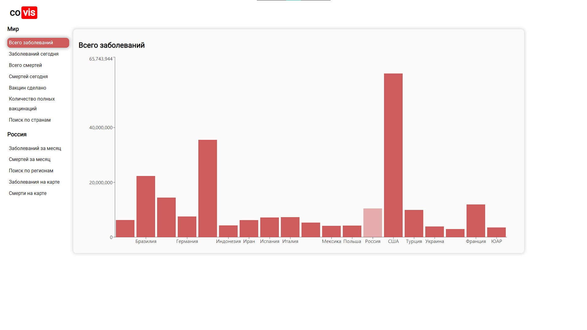

# [covis](https://gaskeo.github.io/covis)



Site with information about COVID-19. It gets data from [yandex API](https://yandex.ru/covid19/stat).

You can visit covis [here](https://tikovka72.github.io/covis)

---

The site was written on [react](https://ru.reactjs.org/). 

## Running
### From github
To create deployment version of the project:
1. download and install [node.js](https://nodejs.org/en/download/)
2. run following command in project directory:
```
npm run build
```
After that all files will be in folder `build`

### From [docker hub](https://hub.docker.com)
1. install [docker](https://docker.com)
2. run following commands:
```
docker pull tikovka72/covis:latest
docker container run -p 80:80 --rm -d --name covis tikovka72/covis
```
To stop container you can use:
```
docker container stop covis
```
You can find all versions of covis [here](https://hub.docker.com/repository/docker/tikovka72/covis/tags)
