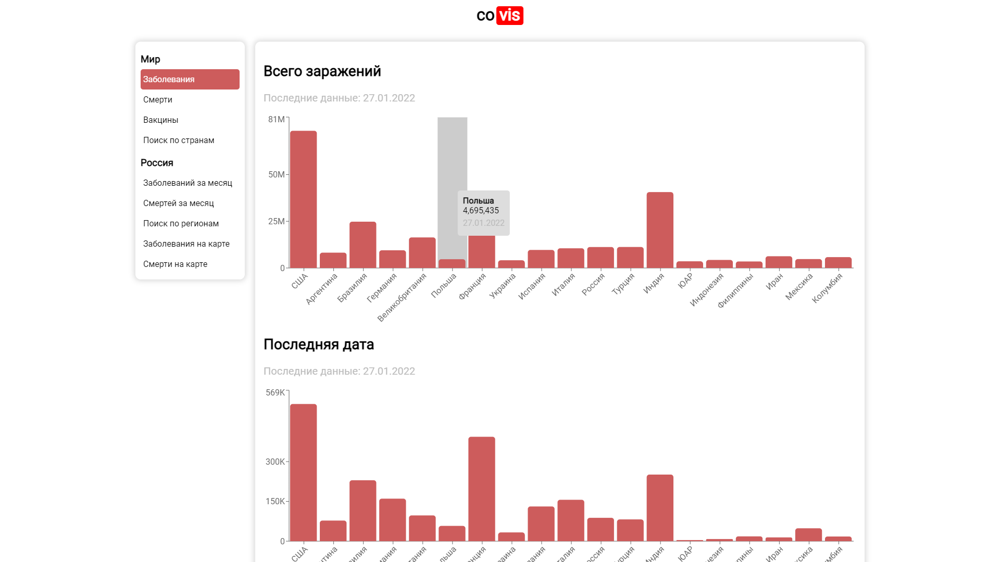
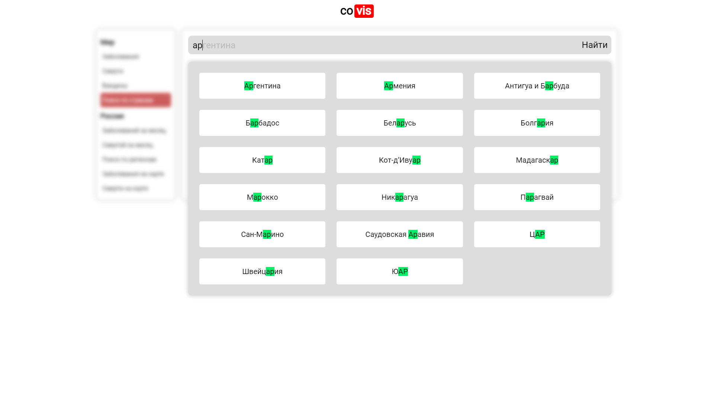
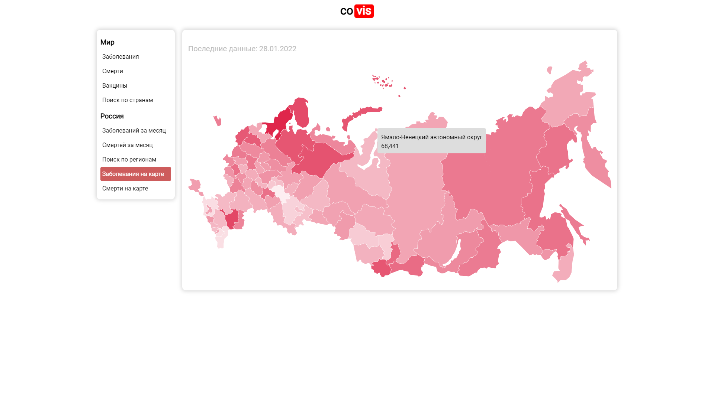

# [covis](https://gaskeo.github.io/covis)

<details>
  <summary><b>Photo gallery</b></summary>

## [Cases page](https://gaskeo.github.io/covis/#/cases)



## [Search page](https://gaskeo.github.io/covis/#/search)



## [Map page](https://gaskeo.github.io/covis/#/casesMap)



</details>


Site with information about **COVID-19**. This site gets data
from [yandex API](https://web.archive.org/web/20220715023857/https://yandex.ru/covid19/stat).

You can visit **covis** [here](https://gaskeo.github.io/covis).


The site was written on [**react**](https://reactjs.org/) with [**recharts** library](https://recharts.org/).

## Running

### From sources

To create deployment version of the project:

1. Download and install [**node.js**](https://nodejs.org/en/download/)
2. Run `npm install` in project directory
3. Build site with `npm run build` command
4. Serve `build/` directory in your server (for example, you can use [Nginx](https://nginx.org/))

> Notice: covis will try to fetch all static from the build/**covis**/static directory because of
> the [canonical URL](https://gaskeo.github.io/covis). If you configure your server by the root URL (for
> example, [yoursite.com/]()) covis will not be able to find static files.
>
> You can change it by passing `/` in `homepage` field in [package.json](package.json):
> ```
> {
>   ...
>   "homepage": "/",
>   ...
> }
> ```